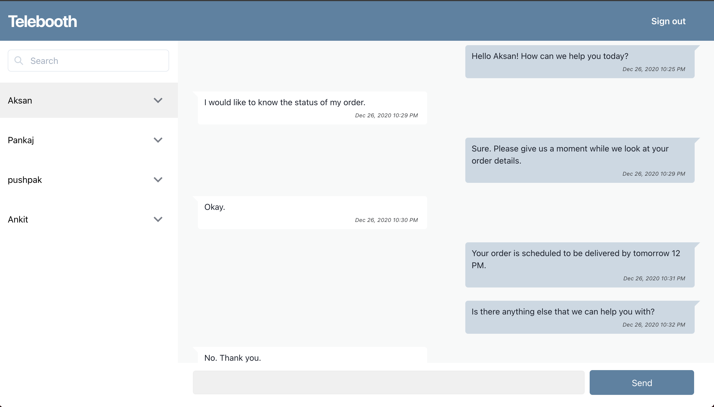
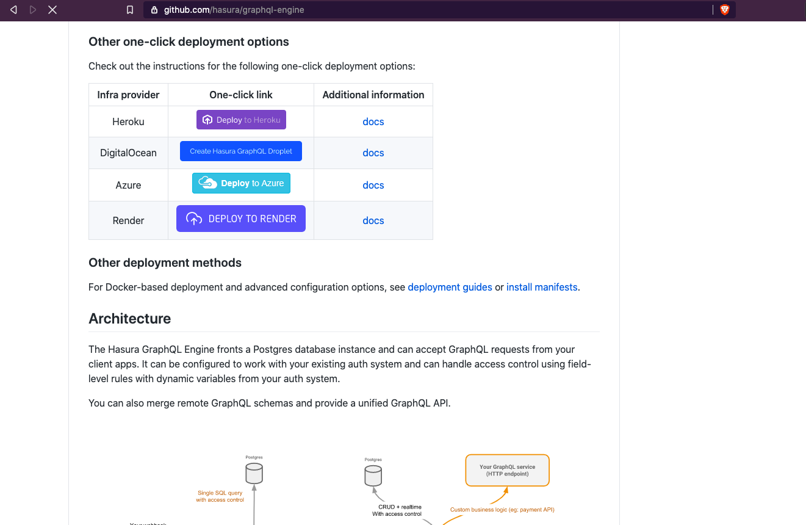
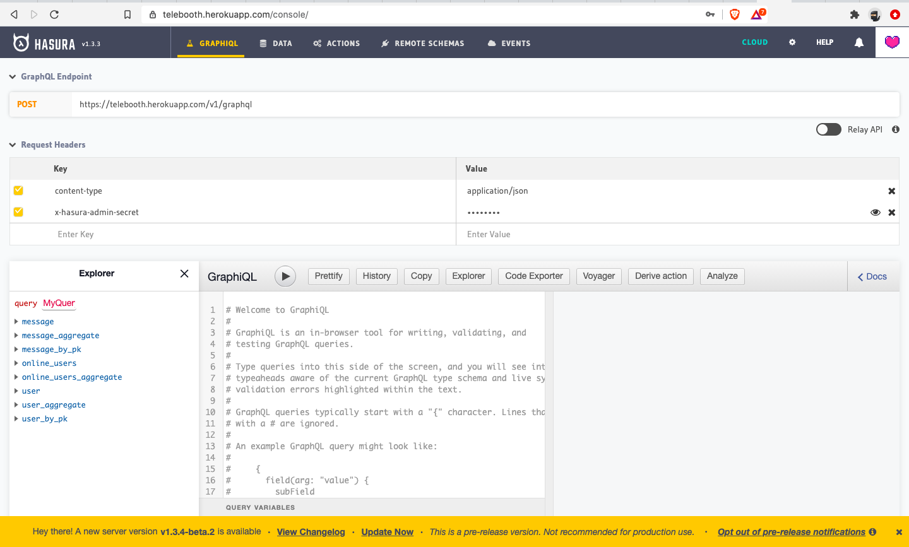
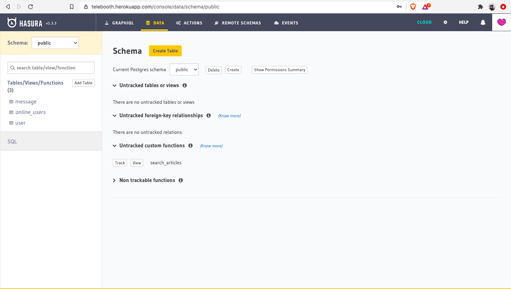
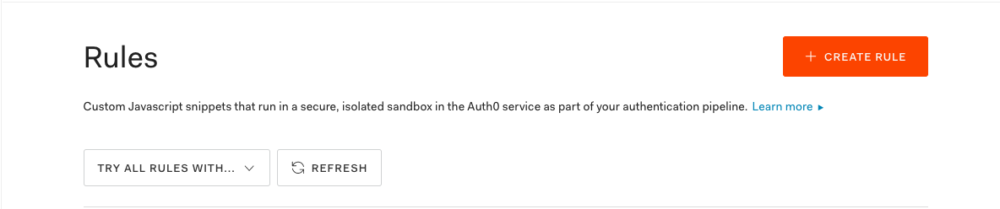

# Telebooth

Telebooth is a self hosted Telegram Bot Manager. Easily create a virtual Telegram identity for your business/community. Self host. No restrictions on number of messages or contacts.

- Create a Telegram Bot for your business or community
- Connect with Telebooth
- Start chatting with your customers/members with the familiar web interface



### Coming soon

- Bulk messages
- Canned responses

### Setup guide

**Tech Stacks used in this projects are**

- NodeJS
- Hasura and GraphQL
- ReactJS
- Auth0 for authentication

## Setup Hasura on Heroku

For quick setup we recommend setting up Hasura on Heroku. There's a one-click deploy to Heroku button on the [Hasura GitHub page](https://github.com/hasura/graphql-engine).



After setting up Hasura on Heroku open the Heroku app to see the Hasura Console.



Now let's secure your Hasura endpoint by adding an Admin Secret as an env variable on your Heroku Config Vars section (Look under settings)

`HASURA_GRAPHQL_ADMIN_SECRET=<mysupersecretpassword>`

Now it is time to configure your Postgres DB, to do this first we need to clone the client and server code of the Telebooth.

To clone the repos, open you terminal and enter following commands.

```jsx
// Telebooth Server code
$ git clone https://github.com/aksanoble/telebooth-server.git

// Telebooth Client code
$ git clone https://github.com/aksanoble/telebooth.git
$ cd telebooth/
```

Now you have both client and server code on your local machine, now we'll set up our Postgres DB on Hasura by uploading metadata and migrations which live inside the telebooth repo under the `hasura/` directory.

To upload metadata on Hasura cloud we need to install the CLI and it is available in both global binary and NPM package.

We'll go ahead and install the NPM package for it globally.

```jsx
$ npm install --global hasura-cli

// You can make sure if it is installed by the following command.
$ hasura --help
```

To apply migration to Postgres DB navigate to `/hasura` directory and enter below commands.

```jsx
// Update endpoint param with your's endpoint value.
$ cd harsura/
$ hasura migrate apply --admin-secret "${admin_secret}" --endpoint https://telebooth.herokuapp.com
// If it is successfully done, you'll get message
INFO migrations applied
```

On your Hasura console you'll see all these tables as below



To access the Hasura server using the web client the user needs to authenticate themselves using JWT token.

Please setup JWT authentication for your Hasura endpoint as per the instructions given here:
[https://hasura.io/docs/1.0/graphql/core/guides/integrations/auth0-jwt.html](https://hasura.io/docs/1.0/graphql/core/guides/integrations/auth0-jwt.html)

Please add the relevant env variables as Heroku config vars instead of Hasura Cloud console.

We need to now configure Auth0 rule to disable new Sign-ups and only allow a predefined user.

Please go to the Auth0 dashboard [https://manage.auth0.com/dashboard](https://manage.auth0.com/dashboard) and go to Rules section.

Click on +Create Rule



Choose the `empty rule` option and add the following rule. Add the email-ids that you want to give access to your app.

```bash
function (user, context, callback) {
  // Access should only be granted to allowed users.
  const allowedUsers = ['admin@mycompany.com', 'support@mycompany.com'];
  if (!allowedUsers.includes(user.email)) {
    return callback(new UnauthorizedError('Access denied.'));
  }

  return callback(null, user, context);
}

```

Save the rule. The app should now be accessible only by select users at your organization.

### Create Telegram Bot

Next thing we need to do it create Telegram bot, please follow the below steps to do it.

- Open Telegram app and search for BotFather.
- Enter `/newbot` in the input and hit enter.
- Now it is going to ask you the username for your bot. Please enter a username for your bot.
- Finally, it will send a message done message with bot token like this `1411597424:AAHRasdfunB9PDX0cqKfwkUnalZfsf_iENrwhE`

### Update env files

Update the `.env.local` file under `telebooth` repo variables with respective values which we have got by performing the above steps.

```bash
// .env.local file
REACT_APP_SERVER_PATH={serverPath}/{botToken}/sendMessage
REACT_APP_GRAPHQL_ENDPOINT={graphqlEndpoint}
REACT_APP_AUTH0_DOMAIN={auth0domain}
REACT_APP_AUTH0_CLIENT_ID={auth0clientId}
REACT_APP_AUDIENCE={auth0Audience}
REACT_APP_HASURA_CLAIMS=https://hasura.io/jwt/claims
REACT_APP_BOT_USERNAME={botUsername}
```

Next, we have to update the `.env` under `telebooth-server` repo with respective variable values.

```bash
BOT_TOKEN={botToken}
WEBHOOK_PATH={serverPath}/secret-path
GRAPHQL_ENDPOINT={graphqlEndpoint}
TELEGRAM_API=https://api.telegram.org
HASURA_ADMIN_SECRET={adminSecret}
```

Now let's deploy the telebooth-server on Heroku. (You may also choose to deploy on any other cloud provider)

The telebooth-server already has a Procfile required for the Heroku deploy. Please follow the instructions given here to deploy the server on Heroku. [https://devcenter.heroku.com/articles/getting-started-with-nodejs](https://devcenter.heroku.com/articles/getting-started-with-nodejs)

Now let's deploy our telebooth client to either Netlify or Github.

[https://www.netlify.com/blog/2016/07/22/deploy-react-apps-in-less-than-30-seconds/](https://www.netlify.com/blog/2016/07/22/deploy-react-apps-in-less-than-30-seconds/) OR
[https://github.com/gitname/react-gh-pages](https://github.com/gitname/react-gh-pages)

You should now be able to use the application by logging into your client. We recommend signing-in with Google using the same account that you had added to the Auth0 rule.

**All constributions welcome!**
